### 🏆삼성 청년 SW아카데미(SSAFY) 12th 공통 프로젝트 우수상 (2위)🏆
# 당신의 눈이 되어주는 AI 부동산 체크리스트

# 목차

<aside>

1. [프로젝트 소개](#프로젝트-소개)
2. [기획 배경](#기획-배경)
3. [화면 소개](#화면-소개)
4. [기술 스택](#기술-스택택)
5. [시스템 아키텍처](#시스템-아키텍처)
6. [프로젝트 산출물](#프로젝트-산출물)
7. [이걸루 History](#이걸루-history)

</aside>

# 🏠프로젝트 소개

## 서비스 설명

- **직접 가지 않아도**, 부동산 매물을 라이브로 소개받을 수 있는 서비스
- 집을 꼼꼼하게 확인할 수 있는 **AI체크리스트**를 제공
- 실시간 매물 라이브로 **허위매물** 탐지

## 주요 기능

- 실시간 라이브를 통한 원격 부동산 중개
- 객체 탐지를 이용한 AI 생성 체크리스트
- 라이브 다시보기 및 메모 지원
- 라이브 요약 지원
- 예약을 위한 실시간 채팅
- 개인별 실시간 알림
- 매물 관리 기능
- 매물 이상형 월드컵

## 프로젝트 기간

2025.01.06 ~ 2025.02.21 (7주)

# 🧅기획 배경

## 배경

20대 사회초년생들이 집을 구할 때 어려움을 해결하기 위해 나타난 서비스 “**이걸루**” 입니다!  SSAFY에 합격해서 집을 구해야 하는데 지금 당장 갈 수 없어서 어려움을 겪지는 않았나요? 이때 집에서도 매물을
실시간으로 매물을 확인할 수 있다면 얼마나 편할까요!?

앱에서 매물을 확인하고, 직접 가보니 이미 없다고 하시는 경우가 없으셨나요? 이걸루 서비스를 통해 직접 라이브를 통해 확인한다면 허위매물이 아니라는것을 바로 확인할 수 있습니다!

처음 집을 구했을때 꼼꼼히 확인하지 못해서 어려움을 겪으시지 않으셨나요? 창문이 남향이 아니라서 빨래가 마르지 않고, 수압이 세지 않아서 머리를 감는데 30분이 걸리고.. 꼼꼼히 확인하지 않아서 집을 구하고 나서
어려움을 겪은 사회초년생들이 많습니다. 저희는 AI 객체탐지를 통해 체크리스트를 자동으로 제공합니다!

## 타겟

- 집을 처음 구해보는 20대 사회 초년생들!
- 당장 집을 구해야 하는데 바빠서 갈 수 없는 사람들!

## 목적

- 직접 가지 않고 매물을 확인하여 시간과 돈을 절약
- 허위 매물인지 라이브를 통해 실제로 존재하는 매물인지 검증
- AI 체크리스트를 통해 사용자가 필수로 체크 해야 하는 목록을 제공

# 💻화면 소개

## 로그인

- 공인중개사와 고객(세입자) 로 나뉘어져 있습니다.

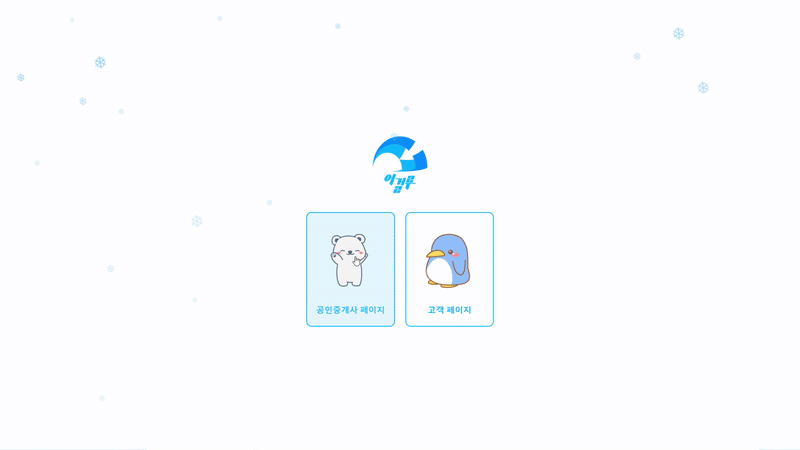

- 고객 로그인

- 공인중개사 로그인

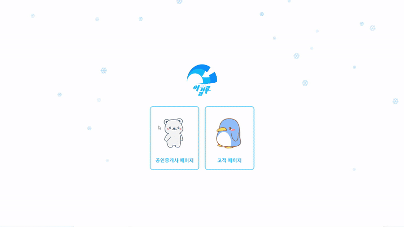

## 메인 페이지 - 세입자

- 세입자 메인페이지 입니다. 세입자는 웹으로 이용할 수 있습니다.
- 메인페이지에는 알람, 채팅을 확인할 수 있습니다.
- 알람의 경우 예약된 날짜를 알려줍니다.

## 원룸 페이지

- 지도페이지에서는 매물들을 확인할 수 있으며, 옵션을 걸어서 원하는 조건의 매물들을 검색할 수 있습니다.

## 이상집월드컵 페이지

- 선택하는데 어려움을 겪는다면 “이상집월드컵” 을 통해 마음에 드는 매물을 고를 수 있습니다.

## 중개인 페이지

- 중개인 페이지에서는 근처 중개인들을 조회 가능하며, 클릭하면 해당 중개인의 상세정보를 살펴볼 수 있습니다.
- 중개인 상세정보 페이지에서는 해당 중개인이 가지고 있는 매물을 볼 수 있는 “매물보기” 기능과 상담을 하기위한 “채팅하기” 기능이 있습니다.

## 고객 라이브 페이지

- 채팅 또는 라이브 방송 참여하기 페이지에서 라이브에 참여할 수 있습니다.
- 사용자 라이브페이지 에서는 AI 체크리스트를 통해 확인해야할 사항을 자동으로 받습니다.
- 사용자가 현재 라이브매물에 기록하고 싶은것을 메모할 수 있습니다.
- 공인중개사가 설정한 매물 순서가 뜨고, 현재 공인중개사의 실시간 위치를 알 수 있습니다.

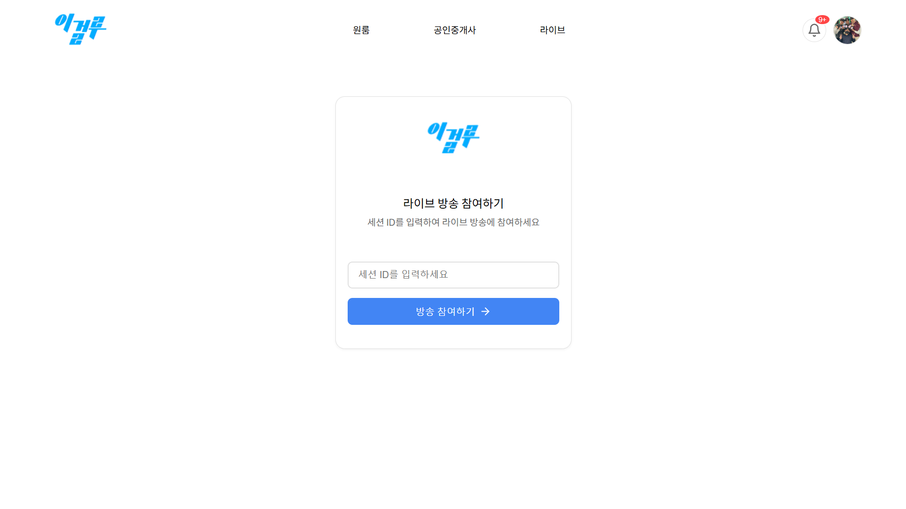

## 공인중개사 라이브 페이지

- 채팅방에서 라이브를 클릭 후, 라이브에서 보여줄 매물을 선택한 후 시작합니다.
- 화살표를 눌러 다음 매물로 넘어갈 수 있습니다.
- 매물별 녹화 버튼을 지원합니다.

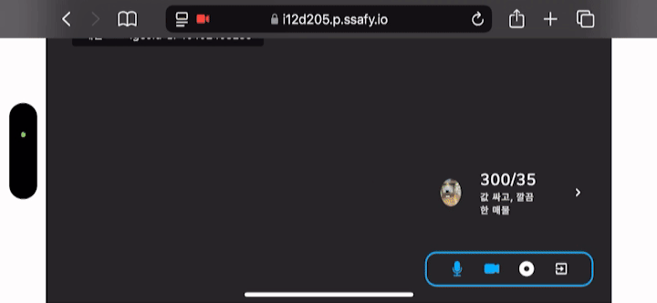

## 마이페이지

- 마이페이지에서는 본인 프로필 사진을 수정할 수 있습니다.
- 공인중개사와 약속된 라이브를 확인할 수 있습니다.
- 과거에 라이브했던 매물을 다시볼 수 있습니다.

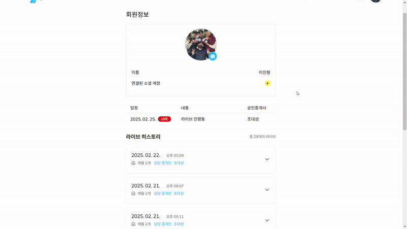

## 다시보기 페이지

- 매물별로 다시보기가 가능합니다.
- 매물별로 CLOVA + GPT 로 요약된 정보를 확인할 수 있습니다.
- 사용자가 별도로 메모한 내용도 확인할 수 있습니다.

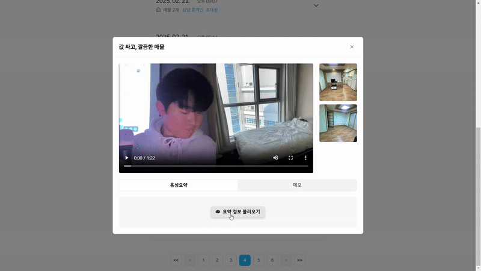

## 메인페이지 - 중개인

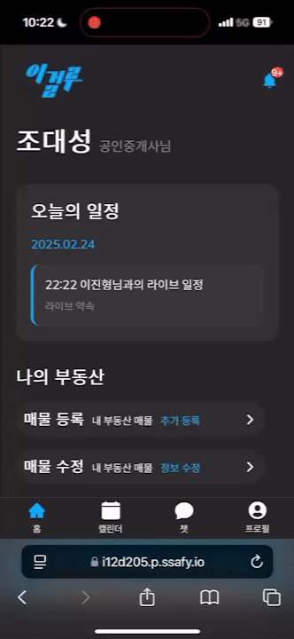

## 달력 페이지 - 중개인

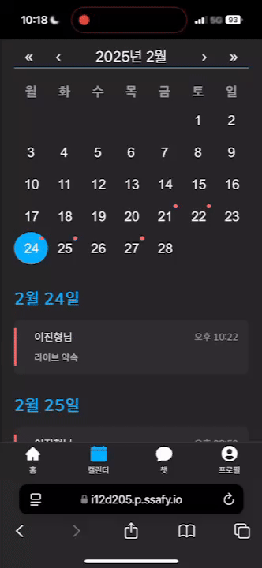

## 채팅 페이지 - 중개인

- 중개인 채팅페이지에서는 “예약” 과 “라이브” 가 가능합니다.
- 라이브를 시작시, 라이브를 할 매물을 선택하고 라이브를 시작합니다.

    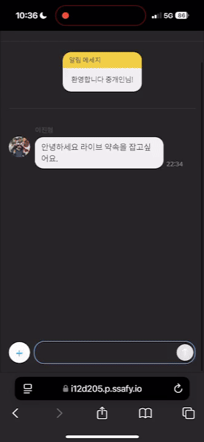
    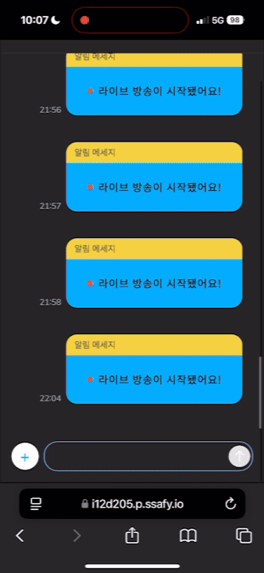

## 마이페이지 - 중개인

- 마이페이지에서 중개인은 새로운 “매물 등록” 이 가능합니다.
- 그리고 등록한 매물에 대해서 “매물 수정” 이 가능합니다.

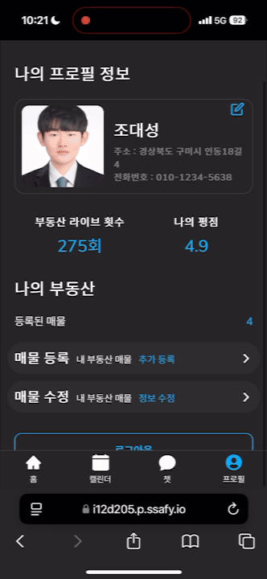

## 매물 등록/수정 페이지

    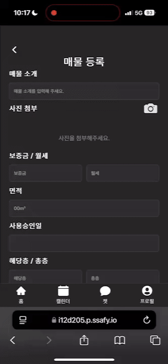
    

# 🛠️기술 스택

| FIELD          | STACK                                                                                                                                                                      |
|----------------|----------------------------------------------------------------------------------------------------------------------------------------------------------------------------|
| **Frontend**   | `React` `NodeJs` `OpenVidu` `Websocket` `css` `html` `yolo`                                                                                                                |
| **Backend**    | `Spring Boot` `Spring Data JPA` `Spring Security` `Spring MVC` `Spring WebFlux` `WebSocket` `OpenVidu` `Mysql` `MongoDB` `Clova Speech` `Chat GPT` `Elasticsearch`         |
| **Infra**      | `AWS EC2` `Jenkins` `Docker` `Docker Compose` `Nginx` `Flask` `Sonarqube` `PostgreSQL` `Elasticsearch` `Logstash` `Kibana` `Filebeat` `Metricbeat` `Elastalert` `Chat GPT` |
| **Management** | `Gitlab` `Jira` `Notion` `Mattermost` `Figma`                                                                                                                              |

## 1. WebRTC + OpenVidu

### WebRTC?

<aside>

WebRTC (Web Real-Time Communication) 은 별도의 서버 없이 P2P 방식으로 피어간의 전송되도록 해줍니다. 별도의 서버를 거쳐서 가지 않으므로 Latency 가 짧다는 장점이 있습니다.

</aside>

### OpenVidu?

<aside>

WebRTC 를 기반으로 만들어진 오픈소스 라이브러리 입니다. Openvidu 2.31.0 버전의 경우 내부적으로 Kurento 미디어 서버를 사용합니다.

</aside>

### 적용

- 이걸루 서비스는 부동산 중개업자와 세입자간에 실시간으로 영상을 공유하기 위해서 OpenVidu 를 사용합니다.
- 이걸루 서비스에서는 연결요청시 **Client ↔ SpringBoot ↔ Openvidu** 통신합니다. 중간에 SpringBoot 를 거치도록 커스텀하여 토큰인증, 다시보기요약 기능 등을 제공할 수 있습니다.
- OpenVidu 의 다시보기 기능을 이용해 매물별로 다시보기를 저장합니다.  **다시보기 → CLOVA STT → GPT**  파이프라인을 구축해, 매물별로 **AI 요약기능**을 제공합니다.

## 2. WebSocket + Spring WebFlux + MongoDB

<table>
  <tr>
    <td></td>
    <td></td>
    <td></td>
  </tr>
</table>

### WebSocket?

<aside>

HTTP/HTTPS 연결이 아닌 WS/WSS 연결을 합니다. 해당 연결은 클라이언트와 서버 간에 지속적으로 연결을 하여 양방향 통신을 가능하게 합니다. 한 번 열린 연결은 계속 유지되어 언제든지 데이터를 전송할 수
있어 실시간성에 적합 합니다.

</aside>

### Spring WebFlux?

<aside>

Spring WebFlux 는 **비동기 논블로킹**방식을 사용합니다. 이는 동기 블로킹방식 보다 훨씬 빠른 속도를 제공하며, 더 적은 리소스를 사용합니다.

</aside>

### MongoDB?

<aside>

NoSQL 의 한종류로 Document 형식으로 데이터를 관리합니다. RDBMS 보다 평균적으로 빠른 조회 속도와 삽입속도를 가지고 있습니다.

</aside>

### 적용

- 채팅은 실시간으로 대량의 데이터를 처리하는게 중요합니다. 그래서 채팅을 구현하기 위해 WebSocket + Spring WebFlux + MongoDB 를 사용했습니다.

### 결과

- 기존의 Spring MVC + MySQL 를 사용했을때와, Spring WebFlux + MongoDB 를 사용했을때 응답속도와 CPU 사용량을 대상으로 JMeter 를 이용해 부하테스트를 진행했습니다.
- 응답 속도의 경우 Spring WebFlux + MongoDB **200% 이상** 빠릅니다.

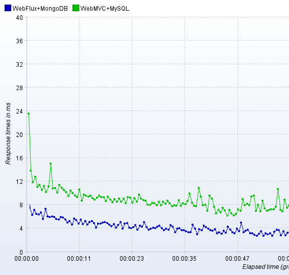

- Spring WebFlux + MongoDB 가 더 빠른 응답속도를 줌에도 불구하고 CPU 사용량은 **63.27% 감소**하였습니다.

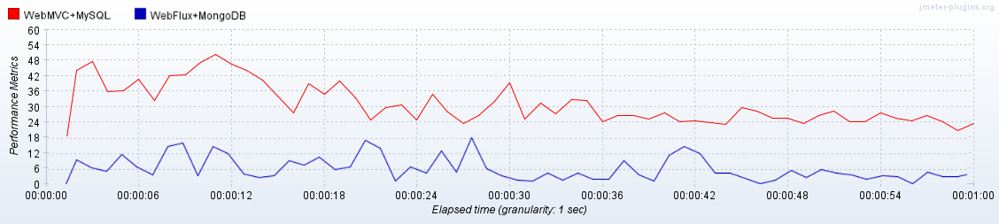

## 3. AI YOLOv11

---

### YOLO?

<aside>

YOLO 는 실시간 객체 탐지를 위한 딥러닝 모델로, 이미지를 분석하면 해당 이미지에 있는 객체를 탐지합니다. CNN 기반으로 특징을 추출하고, 단일 신경망을 통해 객체 위치와 클래스를 예측하여 빠르고 정확한 성능을
제공합니다.

</aside>

### 적용

- 실시간 라이브 서비스에서 객체를 탐지하고, 이를 기반으로 체크리스트를 작성하여 세입자에게 알려줍니다.
- 별도의 서버에서 YOLO 를 사용하지 않고 수신자(세입자)단에서 YOLO 객체 인식을 진행함으로써 지연율을 줄였습니다.

### 결과

- 2025.1.20 기준 가장 최신모델인 YOLOv11 을 사용해 학습을 진행했습니다.

## 4. ELK 검색

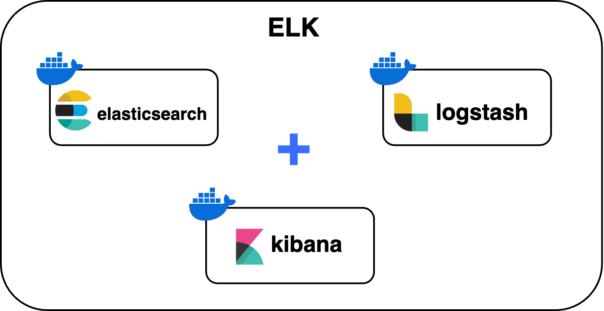

### ELK?

<aside>

**Elasticsearch + Logstash + Kibana** 의 줄임말로 각각 아래와 같은 역할을 합니다.

</aside>

### 적용

- Logstash 를 이용해 Mysql 에 새로 생성되거나 업데이트 된 매물 데이터를 주기적으로 Elastisearch 와 동기화해주었습니다. 1분주기로 동기화를 진행했습니다.
- 동기화된 매물데이터를 대상으로 검색을 할 수 있습니다.
- 시군구 데이터를 Nori, N-gram, 자소 분석기를 이용해 저장해 부분 문자열 일치, 초성 검색, 영어 오타 검색이 가능합니다. 또한 검색필터에 가중치를 중요한 키워드를 우선으로 검색되게 하였습니다.

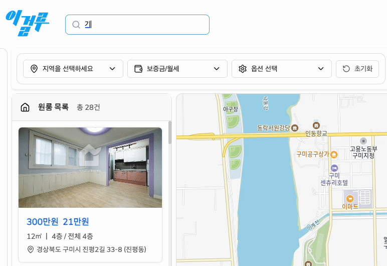

### 결과

- 검색어 자동완성을 대상으로 기존의 MySQL 를 이용했을때와 Elasticsearch 를 이용했을때에 대해 JMeter 로 부하테스틀 진행하였습니다.
- Elasticsearch 를 이용했을 경우 기존 MySQL 를 사용했을 때 보다 **200% 이상** 향상된 응답시간을 보였습니다.

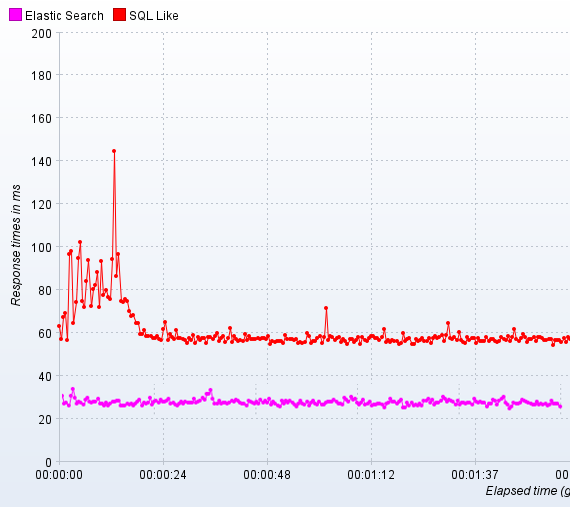

# 🏗️시스템 아키텍처

## 1. Reverse Proxy + Docker network

모든 요청은 Nginx 의 Reverse Proxy 를 이용해 라우팅을 진행했습니다. Nginx 를 제외한 다른 애플리케이션은 외부로부터 직접적인 접근이 불가능하며, 도커 내부 네트워크를 통해서만 접근할 수
있습니다.

관리자만 접근 해야하는 애플리케이션(Jenkins, Sonarqube, Kibana 등) 들은 Nginx 에서 허용한 ip 만 접근할 수 있게하여 보안을 높였습니다.

## 2. AI Code Review

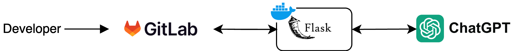

GitLab 에서 특정키워드를 감지하면, Flask 서버로 AI 코드 리뷰를 요청합니다. AI 코드 리뷰를 통해 빠른 피드백을 받고, 팀원들의 시간을 절약하여 생산성을 높일 수 있었습니다.

## 3. ELK 로깅

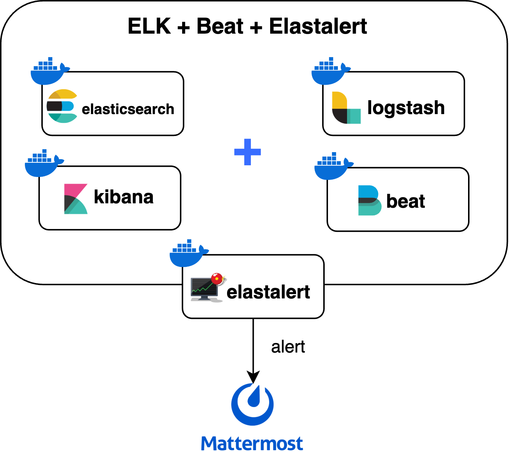

### 필요성

운영중에 가끔 서버가 죽는 현상이 있었고, 이에 대해 조치가 필요하다고 판단했습니다. 그래서 ELK 로깅 시스템을 구축하여 서버의 상태에 따라 알람을 보내도록 설정했습니다.

### 결과

**FileBeat** : Beat 의 한종류로 주로 로그를 수집하는데 사용합니다. Logback 을 이용해 백엔드 서버의 로그 파일을 생성하였습니다. 로그파일에는 로그레벨을 분리하여 DEBUG, INFO,
WARN, ERROR 구분해서 저장하였고, 추가로 API 별 응답시간을 측정해서 저장했습니다. FileBeat 는 해당 로그파일을 읽어 elasticsearch 에 저장합니다. 아래는 Kibana 를 통해 로그를
시각화하여 볼 수 있습니다.

**MetricBeat** : Beat 의 한종류로 메트릭을 수집하는데 사용합니다. EC2 서버의 정보를 주기적으로 수집하여 elasticsearch 에 저장합니다. 아래는 메트릭 시각화 대시보드로, 한눈에 CPU,
RAM 사용량 등을 알 수 있습니다.

**Alarm**
<table>
  <tr>
    <td></td>
    <td></td>
  </tr>
</table>

<table>
  <tr>
    <td></td>
    <td></td>
  </tr>
</table>

<table>
  <tr>
    <td>    
      
    </td>
  </tr>
</table>

- **RAM 평균 사용률** : EC2 RAM 평균 사용률이 90% 를 넘어가면 알람을 보내 서버가 RAM 이 부족한 상태임을 알립니다.
- **RAM 피크 사용률** : EC2 RAM 피크 사용률이 96% 를 넘어가면 위험한 상황임을 알리고, 서버가 다운될 수 있으니 조치를 취할 필요가 있습니다.
- **CPU 평균 사용률** :  현재 EC2 CPU 가 코어가 4개인데, linux 에서는 이를 하나당 100% 까지 취급해 400% 까지 나옵니다. 300% 가 넘어가면 알람을 보내 서버의 부하가 심한 상태임을
  알립니다.
- **CPU 피크 사용률** : EC2 CPU 의 피크 사용률이 390% 를 넘어가면 위험한 상황임을 알리고, 서버가 다운될 수 있으니 조치가 필요합니다.
- **백엔드 서버 에러 알림** : 백엔드 서버에서 1분 내에 에러가 2개 이상 발생했다면, 이는 조치를 취해야하는 상황이라 판단하고 알람을 보냈습니다

# 📔프로젝트 산출물

## 1. Figma

## 2. ERD

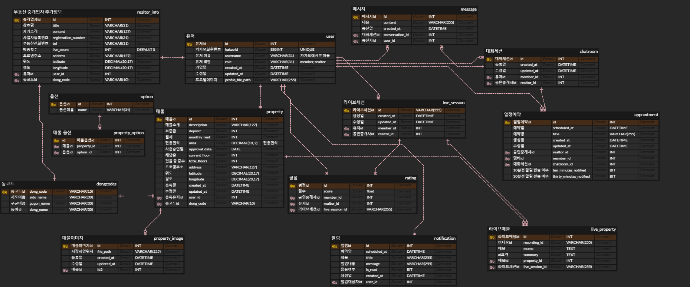

## 3. API

# 🍿이걸루 History

## 팀원소개

<table style="width: 100%; table-layout: fixed;">
    <tr>
        <td><strong>박준수</strong></td>
        <td><strong>오승우</strong></td>
        <td><strong>이진형</strong></td>
        <td><strong>박진훈</strong></td>
        <td><strong>조대성</strong></td>
        <td><strong>최재영</strong></td>
    </tr>
    <tr>
        <td></td>
        <td></td>
        <td></td>
        <td></td>
        <td></td>
        <td></td>
    </tr>
    <tr>
        <td><strong>Frontend</strong></td>
        <td><strong>Frontend</strong></td>
        <td><strong>Frontend</strong></td>
        <td><strong>Backend</strong></td>
        <td><strong>Backend</strong></td>
        <td><strong>Backend</strong></td>
    </tr>
    <tr>
        <td>라이브, 마이페이지, 객체 탐지AI</td>
        <td>채팅방, 유저, 알림</td>
        <td>매물, 지도</td>
        <td>인프라, 객체 탐지AI, 채팅</td>
        <td>라이브, 알림, 다시보기</td>
        <td>발표, 매물, 유저</td>
    </tr>
</table>

## 팀 History

### 2025.02.10 - 몬데이스피치

### 2025.02.07 - AI 로 표현하는 나만의 프로젝트 수상

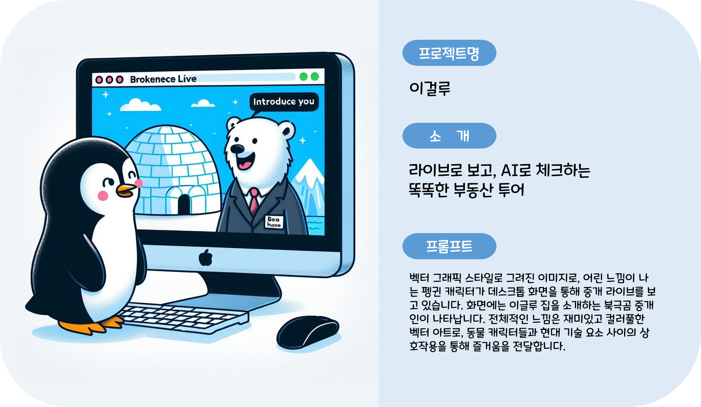

---

### **2025.02.05 - 중간발표**

---

### **2025.01.24 - 곰펭이 등장**

<table>
  <tr>
    <td align="center"></td>
    <td align="center"></td>
    <td align="center"></td>
  </tr>
</table>

<table>
  <tr>
    <td align="center"></td>
    <td align="center"></td>
    <td align="center"></td>
  </tr>
</table>

---

### **2025.01.17 - SSAFY BEST TEAMWORK 수상**

