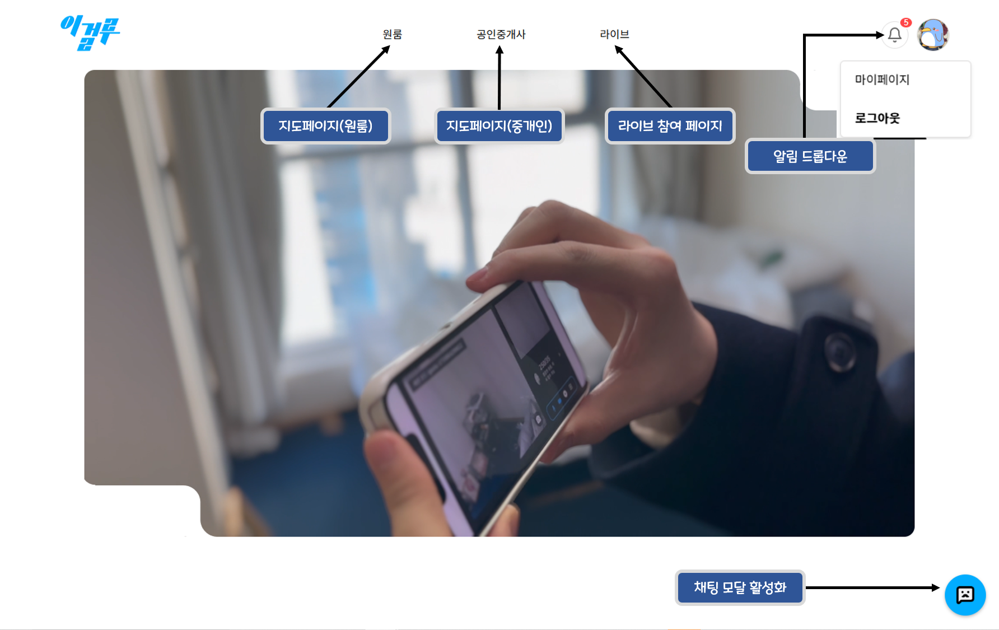
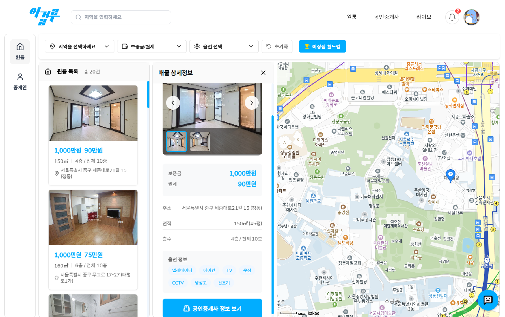
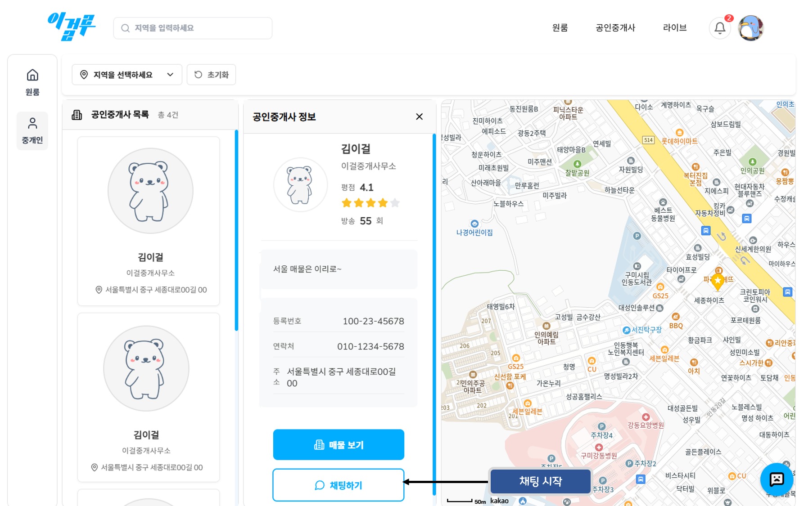
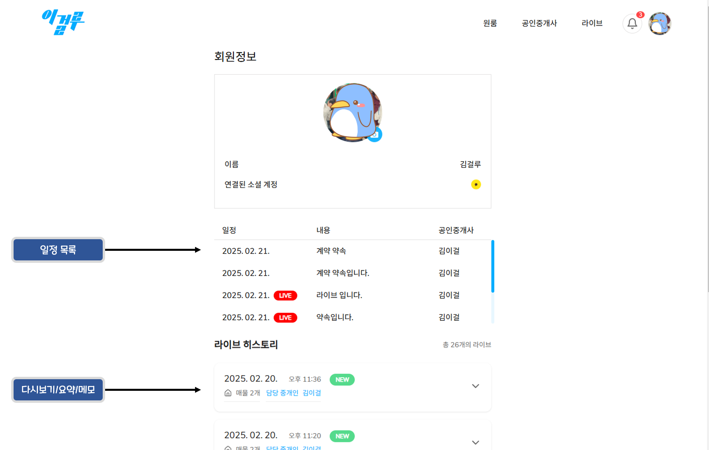
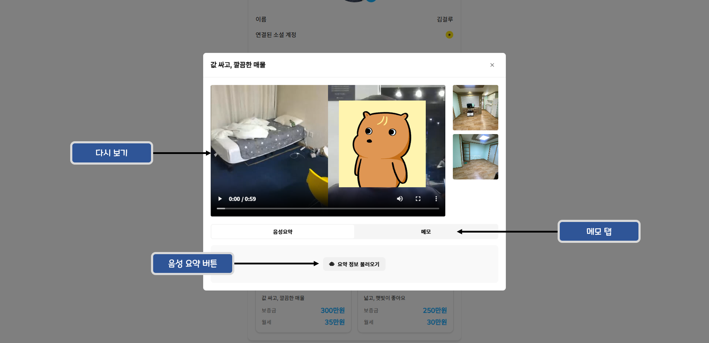
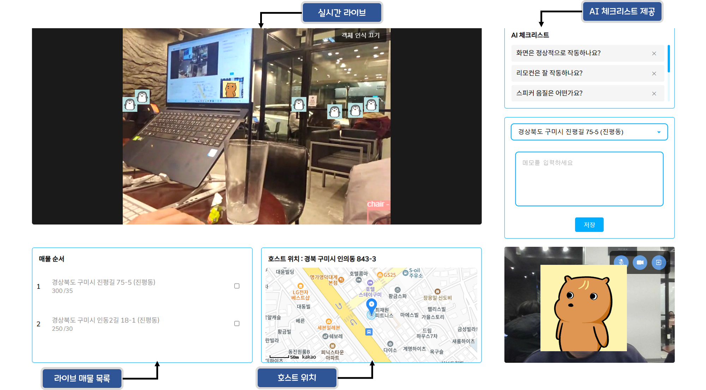
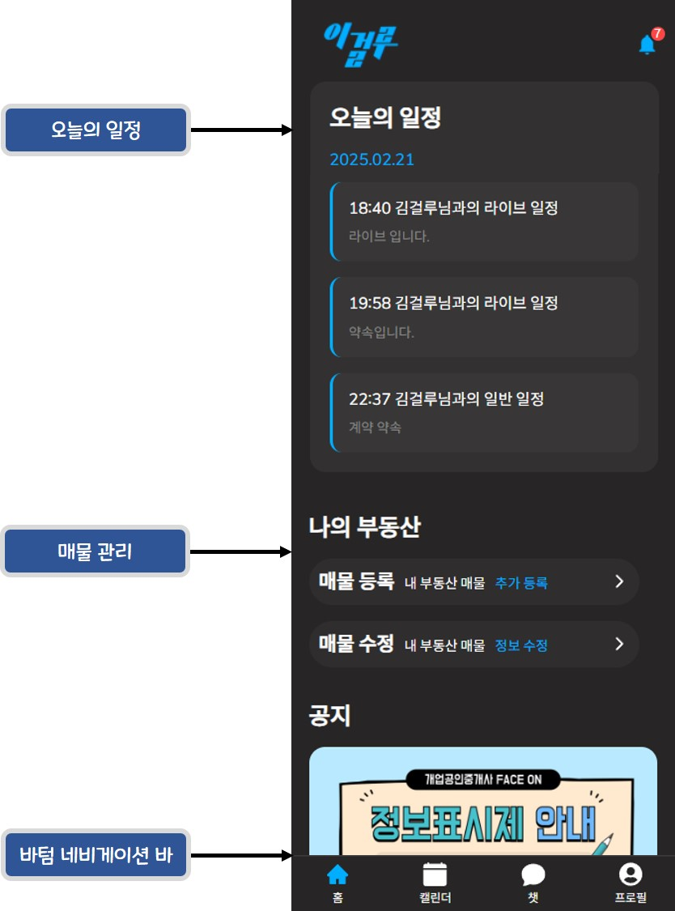
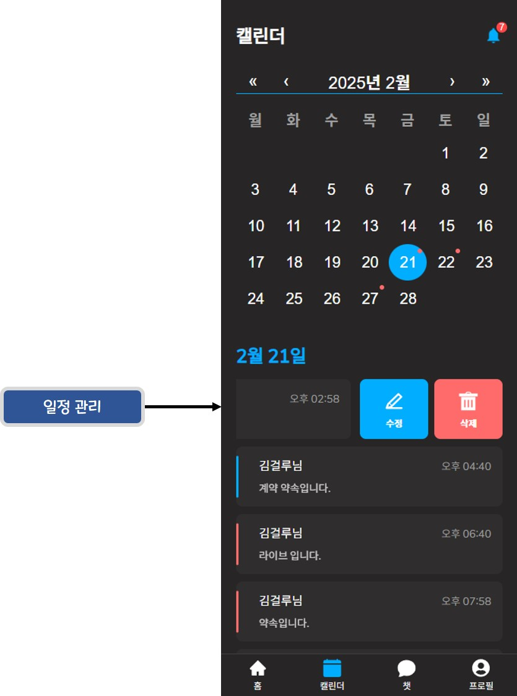
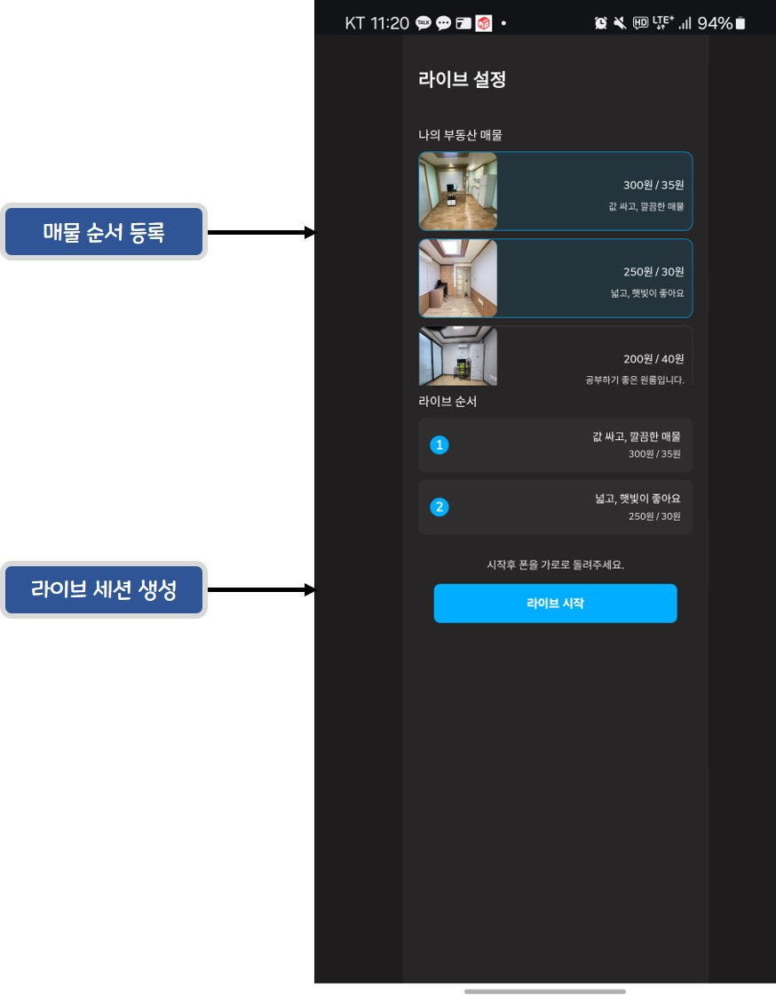
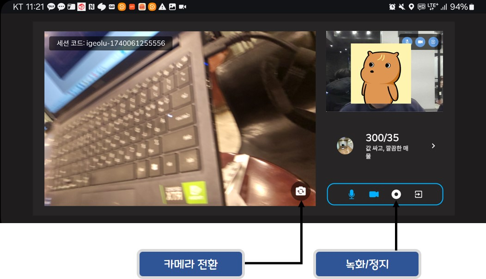

# 포팅 매뉴얼 - 시연 시나리오

# 시연 절차

### 고객 플로우

| 단계 | 화면명             | 실행 동작                                            | 클릭 위치 및 입력 값                                       | 예상 결과                             |
| ---- | ------------------ | ---------------------------------------------------- | ---------------------------------------------------------- | ------------------------------------- |
| 1    | 통합 로그인 페이지 | 페이지별 버튼 클릭                                   | [고객 페이지] 버튼 클릭                                    | 로그인 화면으로 이동                  |
| 2    | 로그인 페이지      | 정보 입력 후 로그인 혹은 소셜 로그인                 | ID, PWD 입력 후 로그인 버튼 클릭 혹은 소셜로그인 버튼 클릭 | 데스크탑 메인 화면으로 이동           |
| 3    | 메인 페이지        | 원룸 메뉴 클릭                                       | 네비게이션 바에서 [원룸] 클릭                              | 지도 페이지 화면 이동                 |
| 4    | 지도 페이지        | 매물 검색, 필터 설정 후 원하는 매물 탐색             | 검색창에 [지역]검색, 아래 매뉴에서 필터 설정               | 지도 컴포넌트에 필터에 맞는 매물 표시 |
| 5    | 지도 페이지        | 이상집 월드컵 버튼 클릭                              | 필터 메뉴 옆의 [이상집 월드컵] 버튼 클릭                   | 이상집 월드컵 모달 창 활성화          |
| 6    | 이상집 월드컵      | 각 매물 비교 후 최종 매물 선정                       | 마음에 드는 매물 클릭, 최종적으로 [매물 보기] 버튼 클릭    | 최종 선정 매물 상세 정보로 이동       |
| 7    | 지도 페이지        | 매물 정보와 담당 중개인 확인 후 채팅 시작            | [공인중개사 정보 보기] - [채팅하기]                        | 채팅방 모달 활성화                    |
| 8    | 채팅방             | 중개인과 대화, 생성된 라이브 세션에 참여             | 대화창 통해 대화, 라이브 시스템 메세지의 버튼 클릭         | 라이브 페이지로 이동                  |
| 9    | 라이브 페이지      | 매물 라이브를 보면서 AI 체크리스트, 메모 시스템 이용 | AI 체크리스트 클릭, 메모 타이핑                            | 매물 별 메모 저장                     |
| 10   | 라이브 페이지      | 라이브 종료 후 평점 체크                             | 평점 선택 후 버튼 클릭                                     | 평점 제출 후 메인 페이지로 이동       |
| 11   | 메인 페이지        | 마이 페이지로 이동                                   | [프로필 이미지] 클릭 - [마이 페이지] 클릭                  | 마이 페이지로 이동                    |
| 12   | 마이 페이지        | 라이브 히스토리에서 봤었던 매물 선택                 | 라이브 히스토리 목록 클릭, 매물 클릭                       | 다시보기 모달 활성화                  |
| 13   | 다시보기 모달      | 음성 요약 버튼으로 요약 정보 확인, 메모 확인         | [음성 요약] 버튼 클릭, [메모] 탭 이동                      | 봤었던 매물 정보 확인                 |

### 중개인 플로우

| 단계 | 화면명                    | 실행 동작                                             | 클릭 위치 및 입력 값                                                                    | 예상 결과                                |
| ---- | ------------------------- | ----------------------------------------------------- | --------------------------------------------------------------------------------------- | ---------------------------------------- |
| 1    | 통합 로그인 페이지        | 페이지별 버튼 클릭                                    | [공인중개사 페이지] 버튼 클릭                                                           | 로그인 화면으로 이동                     |
| 2    | 로그인 페이지             | 정보 입력 후 로그인 혹은 소셜 로그인                  | ID, PWD 입력 후 로그인 버튼 클릭 혹은 소셜로그인 버튼 클릭                              | 모바일 메인 화면으로 이동                |
| 3    | 모바일 메인 페이지        | 바텀 네비게이션 바 통해서 모바일 채팅방 페이지로 이동 | 바텀 네비게이션 바의 [채팅] 버튼 클릭                                                   | 모바일 채팅방 페이지로 이동              |
| 4    | 모바일 채팅 페이지        | 고객과 대화 후 라이브 생성 페이지로 이동              | 채팅방의 메세지 입력 창 통해서 대화, [+]-[라이브] 버튼 터치로 라이브 생성 페이지로 이동 | 고객과 대화 후 라이브 생성 페이지로 이동 |
| 5    | 모바일 라이브 생성 페이지 | 라이브 할 매물 선택 후 라이브 세션 생성               | 라이브 할 매물 순서대로 터치, [라이브 시작] 터치                                        | 모바일 라이브 페이지로 이동              |
| 6    | 모바일 라이브 페이지      | 고객에게 매물 소개, 영상 녹화, 다음 매물 넘어가기     | 우측 하단 버튼 터치해서 녹화-중단, [>]버튼으로 다음 매물 넘어가기                       | 고객과의 라이브 중개 서비스              |
| 7    | 모바일 라이브 페이지      | 나가기 버튼을 통해 라이브 종료                        | [나가기]버튼 터치                                                                       | 모바일 메인 페이지로 이동                |

---

# 스크린샷

### 메인페이지 화면

### 지도페이지원룸 화면

### 지도페이지중개인 화면

### 마이페이지 화면

### 마이페이지모달 화면

### 라이브페이지 화면

### 모바일메인페이지 화면

### 모바일캘린더페이지 화면

### 모바일라이브생성페이지 화면

### 모바일라이브페이지 화면

